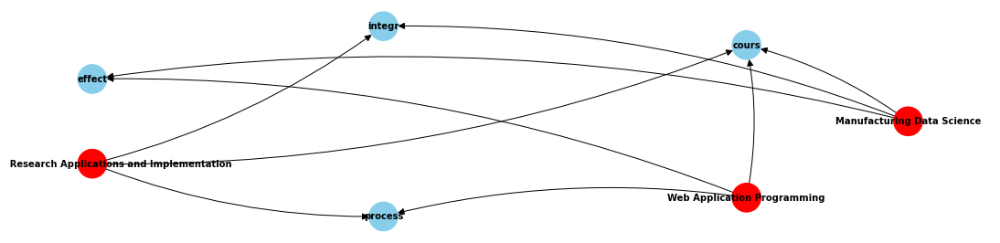
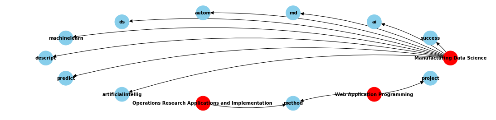

# Textual Knowledge Graph Construction based on Operations Research
**`December 26, 2023 / by Yu-Shin, Hu and Chih-Yao, Hsu`**

This is a project exploring the potential of applying Operations Research (OR) techniques to address Natural Language Processing (NLP) problems. The research objective is focused on 'shrinking the Knowledge Graph (KG) of courses and summarizing course keywords through Multi-Objective Optimization.'

## A preview of our project  
There is a bunch of class info on the NTU course website. For example, here is the course information for 'Operations Research Applications and Implementation'.

Firstly, we can crawl the courses' names and the corresponding text easily through our **crawler module**.  

Next, leveraging our **preprocessing module**, we can tokenize the introduction text of the courses. In our example, there will be a list, which may seem like ['student', 'learn', 'methodology', **'operations research'**[1], application,...]. We consider these words as keywords, or having a relationship --"represent"-> to the course on course KG. 
[1]How we tokenize words like 'operation research' other than single words will be explained in **n-gram module**. 

As we can see, there are lots of redundent words, such as 'student', and 'learn', if we are discussing **"keywords"** of a course. We introduce our **Multi-Objective Optimization model** to explore another approach to replace traditional **Keyword Extraction** methods. 
Those modules and our model will be introduced in Chapter 2.

## Table of Contents
1.    Introduction  
    1.1    Background and Motivation  
    1.2    Problem Definition  
2.    Methodology  
    2.1    Research Framework  
    2.2    Document Pre-Processing and Supplementary Modules  
    2.3    Solver  
    2.4    Model Formulation  
    2.5    Multi-Objective Optimization  
3.    Case Study and Analysis Result  
    3.1    Case Study: Links between NTU IM Courses  
    3.2    Result  
4.    Conclusion  
    4.1    Comments and Insights  
    4.2    Limitations  
    4.3    Future Work  
5.    Reference  

## 1. Introduction
### 1.1 Background and Motivation
To the best of our knowledge, there are few published papers discussing this kind of topic utilizing operations research techniques on NLP problems. Therefore, we are interested in how these directions would evolve. There are tons of tasks that may be defined as NLP problems, we chose "**Keyword Extraction** on course KG" as our topic because  
1. It provides the user of the system an intuitive and innovative approach to search other than retrieving the preferable result only when typing in the specific same words in the class name.
2. It provides an automatic way to show the keywords for the classes, further making the browsing process more efficient. 

### 1.2 Problem Definition
This study proposes a Multi-Objective Optimization model to maximize the information value for the course KG and minimize the redundant words to make the words on it truly keywords at the same time.

## 2. Methodology
### 2.1 Research Framework
Our research framework involves several key steps. Initially, we collect documents, including their titles and contents, through web crawling. Subsequently, we preprocess these documents to prepare them for analysis and then feed the relevant information into our Multi-Objective Optimization model. The final output of our framework consists of critical words extracted from the documents, which are then used to construct a comprehensive knowledge graph. In essence, our project leverages OR for information extraction, ultimately contributing to the construction of a knowledge graph.

Note that the collected documents should include the titles and contents, which, in this study, refer to the course names and their corresponding course summaries. Titles and keywords of contents represent the 'entity' of a knowledge graph.

### 2.2 Document Pre-Processing and Supplementary Modules

#### 2.2.1 Supplementary Modules 
**Crawler module**

In our project, we have to obtain all of the course data from the website first. 
It is a tool developed with Selenium, a web browser automation tool that can help us interact with websites by code, and Beautiful Soup, a classic crawling tool that is intuitive and relatively easy to use. 
In Crawler.ipynb you can input a desirable department ID to our function crawlByDepId(depId) and it will give you a csv file with all of the classes' "ClassId", "ClassName" and "ClassSummary" 

**n-gram module**

Sometimes, there words like 'machine learning' or 'data science' only convey their intended meaning when combined. Otherwise, they fail to communicate the true concept.
We have two basic ways to solve this problem. 
1. Using the n-gram method, which helps you find the frequency ranking of n consecutive words in the text you are interested in. For example, after preprocessing, we put text from a blog of data science to the n-gram function. Then, we get ['artificial intelligence', 'machine learning', 'big data', 'deep learning', ...] which can also be seen as the most popular word in this topic.
2. Asking chatGPT which is the most popular world in certain topics. For example, we ask chatGPT: "Give me the top 24 keywords in the field Operations research." and we get ['Linear Programming', 'Inventory Management', 'Stochastic Processes', 'Decision Analysis'...].  
We put our 2-gram example in dictionary.pickle. With this dictionary, we can tell which words pair should be together rather than be separated arbitrarily.

#### 2.2.2 Document Preprocessing
The document preprocessing techniques are utilized first to simplify texts and help reduce the modeling complexity, which can further improve the modeling efficiency and reduce noise.

**Translate into English**
-    All the documents are first translated into English form.
-    `from googletrans import Translator`
`translator = Translator()`

**Stemming**
-    We convert the words to the same basic form, in order to reduce vocabulary diversity.
-    `import nltk`
`stemmer = stem.PorterStemmer()`

**Remove stopwords**
-    We remove stopwords such as Preposition, Pronouns, or Auxiliary Verbs, etc.
-    `import nltk`
`nltk.download('stopwords')`
`stop_words = set(stopwords.words('english'))`

**Remove punctuation**
-    `import string`
`string.punctuation`

**Compute word vector**
-    All the words are converted into vector space using Word2Vector, which is a Word Embedding method and helps us consider the semantic representation and contextual relationships.
-    `from gensim.models import Word2Vec`
`model = Word2Vec(....)`

### 2.3 Solver
We opted for the Gurobi solver, acknowledging two limitations that need to be addressed during the model formulation:
-   Gurobi can only solve quadratic or lower-degree programming.
-   The denominator should be a constant, not a variable.

### 2.4 Model Formulation
**Sets and indices**
-   $I$: unique words
-   $i$ or $k$: a certain word
-   $\mathbf{i}$ or $\mathbf{k}$: a certain word vector
-   $|I|$: number of unique words
-   $J$: documents
-   $j$: a certain document
-   $|J|$: number of documents

**Parameters**
-   $a_{ij}$: number of times word i exists in document j
-   $b_{ij}$: whether word i exists in document j
-   $s_{ik}$: similarity between word i and k
-   $t_{i}$: whether word i appears in more than one document

**Decision variables**
-   $x_{i}$: whether to choose word i in the knowledge graph
-   Other decision variables that make the model solvable by the Gurobi solver:
    -   $A_{j}$
    -   $B_{i}$
    -   $tf_{ij}$
    -   $idf_{i}$
    -   $X_{ik}$

**Objectives and formulas**
-   $obj^{tfidf}$: maximize total TFIDF which is an indicator of the word importance in the documents, so as to maximize the chosen word importance of the whole knowledge graph.
$$TF_{ij} = \frac{a_{ij} x_{i}}{\sum_{i' \in I}{a_{i'j} x_{i'}}}$$
$$IDF_{i} = \ln \frac{|j|}{1 + \sum_{j' \in J}{b_{ij'} x_{i}}}$$
$$TFIDF_{ij} = \frac{a_{ij} x_{i}}{\sum_{i' \in I}{a_{i'j} x_{i'}}} \ln \frac{|j|}{1 + \sum_{j' \in J}{b_{ij'} x_{i}}}$$
TF stands for term frequency, indicating the frequency with which a given word $i$ appears in document $j$. IDF, or inverse document frequency, represents the frequency with which a word $i$ appears in the entire collection of documents. A word with a high TF is deemed more important in a specific document, while a high IDF suggests that the word may be too common and less significant. Therefore, TF-IDF is calculated by multiplying these two indices to strike a balance, providing a measure of a word's importance across the entire set of documents.

-   $obj^{wordnum}$: minimize the number of chosen words, to minimize the nodes that need to be compared with the query to speed up the information-searching process.
  
-   $obj^{sim}$: minimize the sum of word similarities, to maximize the information value.
    -    Cosine similarity: $$s_{ik} = 1+{similarity}(\mathbf{i}, \mathbf{k}) = 1+\frac{\mathbf{i} \cdot \mathbf{k}}{\|\mathbf{i}\| \cdot \|\mathbf{k}\|}$$
    -    Minkowski distance: $$s_{ik} = D(\mathbf{i}, \mathbf{k}) = \left( \sum_{m} \left| i_m - k_m \right|^p \right)^{\frac{1}{p}}$$
For similarity, here we try the cosine similarity and the Minkowski distance, their results surprisingly come out the same. Note that 1 is added to the cosine similarity to avoid the negative value; we choose $p$ to be 2, corresponding to the Euclidean distance.

**Constraints**
-   Choose at least $|J|$ words, meaning that the number of chosen words not less than the number of documents: $\sum_{i \in I} x_{i} \geq |J|$
-   Only keep words that can connect different documents to help build the knowledge graph of courses (here we set this constraint as optional since the connecting words are very limited):
    $t_{i} \geq x_{i}, \forall i \in I$
-   Constraints that form the objective function:
    -   $obj^{tfidf} = \sum_{i \in I, j \in J} tf_{ij} idf_{i}$
    -   $obj^{wordnum} = - \sum_{i \in I} x_{i}$
    -   $obj^{sim} = - \sum_{i \in I, k \in I, i \neq k} s_{ik} X_{ik}$
-   Other constraints that make the model solvable by the Gurobi solver:
    -   $A_{j}(\sum_{i' \in I}{a_{i'j} x_{i'}}) = 1, \forall j \in J$
    -   $B_{i}(1 + \sum_{j' \in J}{b_{ij'} x_{i}}) = |j|, \forall i \in I$
    -   $tf_{ij} = (A_{j})(a_{ij} x_{i}), \forall i \in I, j \in J$
    -   $idf_{i} = \ln (B_{i}), \forall i \in I$
    -   $X_{ik} = x_{i} x_{k}, \forall i \in I, k \in I, i \neq k$

### 2.5 Multi-Objective Optimization
Several methods for solving multi-objective problems have been explored in past literature. In this study, we adopt the 'Weighted-Sum Method' to integrate our three objectives and approach the problem as a single-objective problem.

-   Weights of the objectives are $w^{tfidf}$, $w^{wordnum}$, $w^{sim}$, with $w^{tfidf} + w^{wordnum} + w^{sim} =1$
-   In the subsequent examples, the three weights are configured to be 1/3 each.

**Weighted-Sum Method**

Its goal is to minimize the weighted sum of all objectives.
    $$w^{tfidf} \frac{obj^{tfidf}}{obj^{tfidf, max}} + w^{wordnum} \frac{obj^{wordnum}}{obj^{wordnum, max}} + w^{sim} \frac{obj^{sim}}{obj^{sim, max}}$$

**Lp-Metric Method**

It aims to reduce the digression between objective functions and their ideal solution.
    $$w^{tfidf} \frac{obj^{tfidf}-obj^{tfidf, max}}{obj^{tfidf, max}} + w^{wordnum} \frac{obj^{wordnum}-obj^{wordnum, max}}{obj^{wordnum, max}} + w^{sim} \frac{obj^{sim}-obj^{sim, max}}{obj^{sim, max}}$$

Note that in this case, we normalize the three objectives, making the Weighted-Sum Method and Lp-Metric Method essentially equivalent.

## 3. Case Study and Analysis Result

### 3.1 Case Study: Links between NTU IM Courses
We conducted a case study on the links between courses at National Taiwan University (NTU). We identified certain existing limitations in the course overviews, including a scarcity of prerequisite relationships between courses. This lack of detailed information poses challenges for students seeking to study across different fields and disciplines.

Our research is aimed at addressing these limitations by constructing knowledge graphs for courses within the National Taiwan University's Institute of Information Management (NTU IM). This initiative holds several benefits, such as facilitating the development of a search engine tailored to course information. Additionally, it aids students in comprehending their learning trajectories and provides clarity on cross-disciplinary learning paths.

To simplify the problem, we have selected three courses, and gathered the names of the courses along with their respective course overviews to serve as our documents. It can be noted that only the first two are associated with prerequisites.

| Index | Name                                                | Overview                                                                                                                                                                                                                                                                                                                                                                                                                                                                                                                                                                                                                                                                                                                                                                                                                                                      |
|---:|:----------------------------------------------------|:--------------------------------------------------------------------------------------------------------------------------------------------------------------------------------------------------------------------------------------------------------------------------------------------------------------------------------------------------------------------------------------------------------------------------------------------------------------------------------------------------------------------------------------------------------------------------------------------------------------------------------------------------------------------------------------------------------------------------------------------------------------------------------------------------------------------------------------------------------------|
|  0 | Manufacturing Data Science                          | mds course supports students learning how to apply artificialIntelligence (ai), machineLearning, dataScience (ds) techniques to improve the effectiveness and efficiency of the manufacturing systems. mds integrates the knowledge domains of the information, engineering, and management. encourage students to solve the real problem systematically using the design of analytics, from descriptive, diagnostic, predictive, prescriptive to automating, for successfully enhancing decision quality.                                                                                                                                                                                                                                                                                                                                                    |
|  1 | Operations Research Applications and Implementation | this course will provide students to learn the methodologies of operationsResearch and its applications to the real problem. the models include deterministic models (such as linearProgramming, multi-criteria decisionAnalysis, data envelopment analysis, etc.) and stochasticModels (such as bayesian decisionAnalysis, stochasticProgramming, markovDecision process, etc.). the course integrates the knowledge domains of the management and engineering, applied in capacity planning, facility layout, supply chain, manufacturing scheduling, performance evaluation, vendor selection and order allocation, bin-packing, financial investment, etc. we develop the implementation capability of the information system in practice. finally we should know how to solve the real problem systematically using optimization or statistical methods. |
|  2 | Web Application Programming                         | this course covers basic concepts and applications such as web design, back-end database, and web page conversion into mobile app, such as html5, css3, javascript, jquery, jquery mobile, sql, nosql, and cordova. throughout the course, by using a certain field as the theme and using projectManagement methods to create projects with the goal of solving real problems, the purpose of learning is further achieved and students' learning effectiveness is improved. through group discussions and project reports, students can share their problem-solving processes and reflections, thereby improving the learning effect.                                                                                                                                                                                                                       |
### 3.2 Result

Here are our results. The red dots represent courses; blue dots represent critical words extracted from course overviews, chosen using our OR model. Also, in this visualization, we have set the weights of the three objectives as equal. We experimented with both cosine and Euclidean distances as similarity measures separately, resulting in identical outcomes as shown in the accompanying image.

**Result when only choose words that can connect different documents**

Three courses are connected in the knowledge graph, enabling us to understand the connection between courses. However, upon closer inspection, we observed that the selected words may not be sufficiently representative or specific. This discrepancy led us to analyze the data further, revealing that all the connecting words of the three courses are actually limited, too common and lack representativeness:
> systemat, student, learn, engin, solv, process, real, system, method, problem, manag, manufactur, applic, knowledg, appli, use, improv, cours, inform, domain, integr, effect, design

**Result when there is no only-connecting-words limitation for chosen words**

Here are the results without limitations on chosen words, indicating that we are not restricting the selection to words connecting different documents. The model has successfully identified representative keywords, with minimal inclusion of common words in the chosen set. This outcome is considered favorable in filtering unimportant words.

## 4. Conclusion

### 4.1 Comments and Insights
-    To give a summary of this project, the OR model is used to build KG in the NLP problem.
-    An unexpected finding is that when altering the similarity calculation method, whether using cosine similarity or Euclidean distance, the model produced identical results. It becomes evident that there is more to explore in our understanding of the application of text and word indicators in the realm of OR.
-    The challenge in successfully establishing a robust knowledge graph lies in the insufficient presence of connecting words between courses, and their lack of representativeness. Hence, focusing on information extraction of representative connecting words between documents is recommended for future development.

### 4.2 Limitations
Size limit of the Gurobi solver: this method faces a constraint related to the size limit of the Gurobi solver. This limitation hinders the construction of knowledge graphs beyond a certain size. 
Which may bring about 3 main shortcomings…
1.	A limitation to our solution capability. In our case study example, there are only three classes. Therefore, even the normal words to courses like “achieve” or “discussion” may stand out owing to the limited number of courses. E.g., if there are 50 courses, the probability we see those normal words is tremendous and the model cuts down the importance of those words. However, within three courses, there might be only one occurrence, which makes the word as crucial as words like “Operations research” or “Data science”.
2.	A limited number of connecting words across different courses: there is insufficient diversity in connecting words due to the data size limit. As a result, the objective of establishing a comprehensive knowledge map between courses cannot be fully realized.
3.	Absence of fixed solution occurs when larger datasets: we've observed that there is no fixed solution when more courses are included. Gurobi may find local optimal solutions in this kind of complex problem, raising concerns about achieving the global optimum.

### 4.3 Future Work
-    Perform clustering of similar words: clustering similar words is beneficial in reducing the model's complexity while enhancing connections between documents. This improvement holds the potential to extend the applicability of our methodology, enabling the construction of a larger and more comprehensive knowledge graph.
-    Explore additional text-related metrics and experiment with different weight configurations: the significance of each factor in constructing an effective knowledge graph is still uncertain, so more experiments are needed.

## 5. Reference
-    Kong, ZY, How, BS, Mahmoud, A., & Sunarso, J. Multi-objective Optimization Using Fuzzy and Weighted Sum Approach for Natural Gas Dehydration with Consideration of Regional Climate. Process Integration and Optimization for Sustainability, volume 6, pages 845–862, (2022).
-    Zihao Zheng, Yang LI, Yitong LIU, Bing QIN, Ming LIU. Text correlation calculation based on passage-level event representation. SCIENTIA SINICA Informationis, Volume 50, Issue 7: 1033 - 1054 (2020).
-    Dongsuk O, Sunjae Kwon, Kyungsun Kim, and Youngjoong Ko. 2018. Word Sense Disambiguation Based on Word Similarity Calculation Using Word Vector Representation from a Knowledge-based Graph. In Proceedings of the 27th International Conference on Computational Linguistics, pages 2704–2714, Santa Fe, New Mexico, USA. Association for Computational Linguistics.
-    Kwon, Sunjae, O, Dongsuk, Ko, Youngjoong. Word Sense Disambiguation based on Context Selection using Knowledge-based Word Similarity. Information Processing & Management, 58(4), 2018.
-    ZHONG Weifeng, YANG Hang, CHEN Yubo, LIU Kang, ZHAO Jun. Document-level Event Extraction Based on Joint Labeling and Global Reasoning. Journal of Chinese Information Processing, 2019, Vol. 33.

