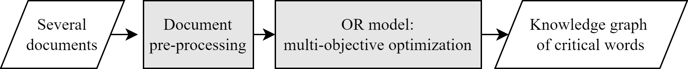
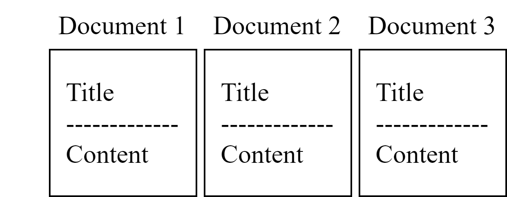

# Textual Knowledge Graph Construction based on Operations Research
This is a project exploring the potential of applying Operations Research (OR) techniques to address Natural Language Processing (NLP) problems. The research objective is focused on 'shrinking the Knowledge Graph (KG) of courses and summarizing course keywords through Multi-Objective Optimization.'

## A preview of our project  
There is a bunch of class info on the NTU course website. A case and a point,

We can crawl the courses' names and the corresponding text easily through our **crawler module**.
 

Next, leveraging our **preprocessing module**, we can tokenize the introduction text of the courses. In our example, there will be a list, which may seem like ['student', 'learn', 'methodology', **'operations research'**[1], application,...]. We consider these words as keywords, or having a relationship --"represent"-> to the course on course KG. 
[1]How we tokenize words like 'operation research' other than single words will be explained in **n-gram module**. 

As we can see, there are lots of redundent words, such as 'student', and 'learn', if we are discussing **"keywords"** of a course. We introduce our **Multi-Objective Optimization model** to explore another approach to replace traditional **Keyword Extraction** methods. 
Those modules and our model will be introduced in the following article. **Multi-Objective Optimization model** will be presented in Chapter 2. The supplementary function, such as **crawler module**, **preprocessing module**, **n-gram module**, will be demonstrated in Chapter 3.

## Table of Contents
1. Introduction
2. Methodology
3. Data collention, prerocessing and Analysis Result
4. Case study: links between NTU courses
5. Conclusion
6. Reference

## 1. Background and Motivation
### 1.1 Background and Motivation
To the best of our knowledge, there are few published papers discussing this kind of topic utilizing operations research techniques on NLP problems. Therefore, we are interested in how these directions would evolve. There are tons of tasks that may be defined as NLP problems, we chose "**Keyword Extraction** on course KG" as our topic because  
1. It provides the user of the system an intuitive and innovative approach to search other than retrieving the preferable result only when typing in the specific same words in the class name.
2. It provides an automatic way to show the keywords for the classes, further making the browsing process more efficient. 

### 1.2 Problem Definition
This study proposes a Multi-Objective Optimization model to maximize the information value for the course KG and minimize the redundant words to make the words on it truly keywords at the same time.

## 2. Methodology
### 2.1 Research framework
Our research framework involves several key steps. Initially, we collect documents, including their titles and contents, through web crawling. Subsequently, we preprocess these documents to prepare them for analysis, and then feed the relevant information into our Multi-Objective Optimization model. The final output of our framework consists of critical words extracted from the documents, which are then used to construct a comprehensive knowledge graph. In essence, our project leverages OR for information extraction, ultimately contributing to the construction of a knowledge graph.

### 2.2 Solver:
We opted for the Gurobi solver, acknowledging two limitations that need to be addressed during the model formulation:
-   It can only solve quadratic programming.
-   The denominator cannot be a variable.

### 2.3 Model formulation**Sets and indices**
-   $I$: unique words
-   $i$ or $k$: a certain word
-   $\mathbf{i}$ or $\mathbf{k}$: a certain word vector
-   $|I|$: number of unique words
-   $J$: documents
-   $j$: a certain document
-   $|J|$: number of documents

**Parameters**
-   $a_{ij}$: number of times word i exists in document j
-   $b_{ij}$: whether word i exists in document j
-   $s_{ik}$: similarity between word i and k
-   $t_{i}$: whether word i appears in more than one document

**Decision variables**
-   $x_{i}$: whether to choose word i in the knowledge graph
-   Other decision variables that make the model solvable by the Gurobi solver:
    -   $A_{j}$
    -   $B_{i}$
    -   $tf_{ij}$
    -   $idf_{i}$
    -   $X_{ik}$

**Objectives and formulas**
-   $obj^{tfidf}$: maximize total TFIDF, to maximize the information of
    the whole graph.
    -   TFIDF:
    $$TF_{ij} = \frac{a_{ij} x_{i}}{\sum_{i' \in I}{a_{i'j} x_{i'}}}$$
    $$IDF_{i} = \ln \frac{|j|}{1 + \sum_{j' \in J}{b_{ij'} x_{i}}}$$
    $$TFIDF_{ij} = \frac{a_{ij} x_{i}}{\sum_{i' \in I}{a_{i'j} x_{i'}}} \ln \frac{|j|}{1 + \sum_{j' \in J}{b_{ij'} x_{i}}}$$

-   $obj^{wordnum}$: minimize the number of chosen words, to minimize
    the nodes that need to be compared with the query to speed up the
    information-searching process.
-   $obj^{sim}$: minimize the sum of word similarities, to maximize the
    information value.
    -   Cosine similarity:
    $$s_{ik} = {similarity}(\mathbf{i}, \mathbf{k}) = \frac{\mathbf{i} \cdot \mathbf{k}}{\|\mathbf{i}\| \cdot \|\mathbf{k}\|}$$
    -   Minkowski distance:
    $$s_{ik} = D(\mathbf{i}, \mathbf{k}) = \left( \sum_{m} \left| i_m - k_m \right|^p \right)^{\frac{1}{p}}$$

**Constraints**
-   Choose at least $|J|$ words: $\sum_{i \in I} x_{i} \geq |J|$
-   Only keep words that can connect different documents (we set this constraint as optional since the connecting samples are very limited):
    $t_{i} \geq x_{i}, \forall i \in I$
-   Constraints that form the objective function:
    -   $obj^{tfidf} = \sum_{i \in I, j \in J} tf_{ij} idf_{i}$
    -   $obj^{wordnum} = - \sum_{i \in I} x_{i}$
    -   $obj^{sim} = - \sum_{i \in I, k \in I, i \neq k} s_{ik} X_{ik}$
-   Other constraints that make the model solvable by the Gurobi solver:
    -   $A_{j}(\sum_{i' \in I}{a_{i'j} x_{i'}}) = 1, \forall j \in J$
    -   $B_{i}(1 + \sum_{j' \in J}{b_{ij'} x_{i}}) = |j|, \forall i \in I$
    -   $tf_{ij} = (A_{j})(a_{ij} x_{i}), \forall i \in I, j \in J$
    -   $idf_{i} = \ln (B_{i}), \forall i \in I$
    -   $X_{ik} = x_{i} x_{k}, \forall i \in I, k \in I, i \neq k$

**Multi-objective optimization**
-   Weights of the objectives: $w^{tfidf}$, $w^{wordnum}$, $w^{sim}$, with
$w^{tfidf} + w^{wordnum} + w^{sim} =1$
-   Weighted-Sum method
    $$w^{tfidf} \frac{obj^{tfidf}}{obj^{tfidf, max}} + w^{wordnum} \frac{obj^{wordnum}}{obj^{wordnum, max}} + w^{sim} \frac{obj^{sim}}{obj^{sim, max}}$$

## 3. Data collention, prerocessing and Analysis Result
### 3.1. crawler module 
### 3.2. preprocessing module** 
### 3.3. n-gram module

## 4. Case study: links between NTU courses
## 5. Conclusion

## 6. Reference
[Disaster Relief Logistics with Contactless Delivery Policy](https://github.com/Nana2929/ORA-modrl)

